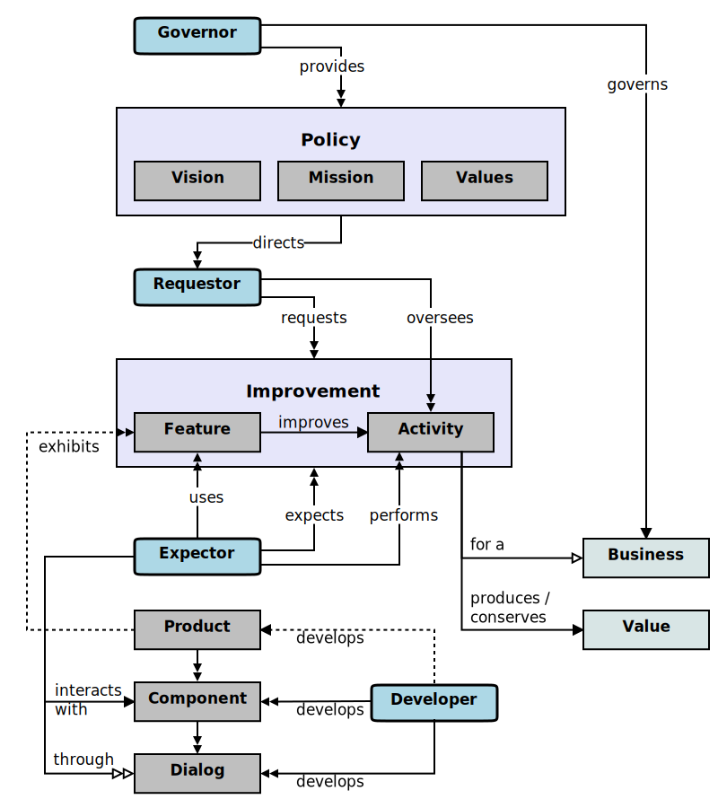

### A Conceptual Model for Software Requirements

This natural conceptual model is a representative sample derived from the one described more fully 
[here][model].

### Overview

[Vision][vision], [mission][mission], and [values][value] articulate
the intended ends of a business and the acceptable means for reaching those
ends. [Purposes][purpose] align business [activities][activity] with the business 
[mission][mission] and [vision][vision]. Business [activities][activity] fulfill a business
[purpose][purpose] and further a business towards its objectives. 
Business [activities][activity] often have opportunities for (measurable) [improvements][improvement].
Software solution [features][feature] support and improve business [activities][activity].
[Dialogs][dialog] reveal solution features and domain information models. 
Software [components][component] surface [dialogs][dialog] and conduct conversations with software
solution [users][user]. 
Solution requirements knowledge and descriptions originate with some official (or unofficial) 
[sources][source].

The relationships between [stakeholders][stakeholder], [sources][source], 
and their knowledge can be modeled and depicted graphically. 
The following diagram shows selected, representative portions of such a natural conceptual model. 
A key to the notation used in this model diagram can be found in [Appendix A][notation].
Descriptions of the essential model elements can be found in the linked pages through the foregoing textual hyperlinks.

[activity]: topics/activity.md
[component]: topics/component.md
[dialog]: topics/dialog.md
[expector]: topics/expector.md
[feature]: topics/feature.md
[improvement]: topics/improvement.md
[mission]: topics/mission.md
[purpose]: topics/purpose.md
[source]: topics/source.md
[stakeholder]: topics/stakeholder.md
[user]: topics/user.md
[value]: topics/value.md
[vision]: topics/vision.md

[model]: https://educery.dev/papers/software-requirements/#conceptual-model
[notation]: https://educery.dev/papers/software-requirements/#model-key
[overview]: images/model-overview.svg
