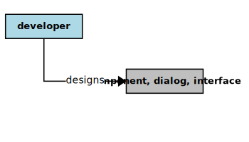

## Developer

In the context of this [model](../README.md), a [Developer][developer]

* <i>designs</i> a [Component][component] or [Dialog][dialog] or [Interface][interface]
* <i>builds</i> a [Component][component] or [Dialog][dialog] or [Interface][interface]
* <i>tests</i> a [Component][component] or [Dialog][dialog] or [Interface][interface]
* <i>serves</i> a [Business][business] as a [Source][source] of some [Estimates][estimates]

### Discussion

There are potentially several kinds of [Developers][developer].
A [Developer][developer] generally develops (or guides, or manages the development of) software [Solutions][solution].
Sometimes their responsibilities (and thus their interests) are combined in a single person or role within an organization.

<h4 align="center"><b>&sect; &sect; &sect;</b></h4>

[activity]: activity.md
[activities]: activity.md
[business]: business.md
[businesses]: business.md
[component]: component.md
[components]: component.md
[developer]: developer.md
[developers]: developer.md
[dialog]: dialog.md
[dialogs]: dialog.md
[expector]: expector.md
[expectors]: expector.md
[feature]: feature.md
[features]: feature.md
[governor]: governor.md
[governors]: governor.md
[improvement]: improvement.md
[improvements]: improvement.md
[interface]: interface.md
[interfaces]: interface.md
[mission]: mission.md
[missions]: mission.md
[requestor]: requestor.md
[requestors]: requestor.md
[solution]: solution.md
[solutions]: solution.md
[source]: source.md
[sources]: source.md
[value]: value.md
[values]: value.md
[vision]: vision.md
[visions]: vision.md

[valuable]: value.md
[quality]: https://educery.dev/papers/modeling/quality-alignment/#business-quality-inventory
