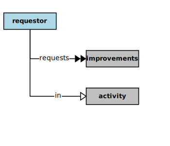

## Requestor

In the context of this [model](../README.md#overview), a [Requestor][requestor]

* <i>requests</i> some [Improvements][improvements] in an [Activity][activity]
* <i>oversees</i> some [Activity][activity] for a [Business][business]
* <i>serves</i> a [Business][business] as a [Source][source] of some [Improvements][improvements] or [Purposes][purposes]

### Discussion

There are potentially several kinds of [Requestors][requestor].
A [Requestor][requestor] generally oversees and requests [Improvements][improvement] in some [Business][business] [Activity][activity](s),
or they may have specific domain knowledge and expertise.
They also ensure that the conduct of [Business][business] [Activities][activity] remain in alignment with the purposes of the [Business][business],
esp. with its [Mission][mission] and [Vision][vision].

<h4 align="center"><b>&sect; &sect; &sect;</b></h4>

[activity]: activity.md
[activities]: activity.md
[business]: business.md
[businesses]: business.md
[component]: component.md
[components]: component.md
[developer]: developer.md
[developers]: developer.md
[dialog]: dialog.md
[dialogs]: dialog.md
[expector]: expector.md
[expectors]: expector.md
[feature]: feature.md
[features]: feature.md
[governor]: governor.md
[governors]: governor.md
[improvement]: improvement.md
[improvements]: improvement.md
[interface]: interface.md
[interfaces]: interface.md
[mission]: mission.md
[missions]: mission.md
[requestor]: requestor.md
[requestors]: requestor.md
[solution]: solution.md
[solutions]: solution.md
[source]: source.md
[sources]: source.md
[value]: value.md
[values]: value.md
[vision]: vision.md
[visions]: vision.md

[valuable]: value.md
[quality]: https://educery.dev/papers/modeling/quality-alignment/#business-quality-inventory
