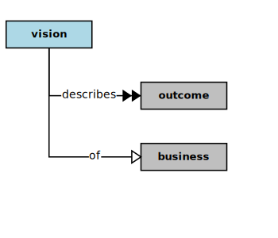

## Vision

In the context of this [model](../README.md#overview), a [Vision][vision]

* <i>describes</i> some [Outcomes][outcomes] of a [Business][business]

### Discussion

A [Vision][vision] statement succinctly expresses a durable purpose, the quality concerns congruent with that purpose,
and potential outcome(s) with respect to that purpose and those concerns. By remaining focused on outcomes
(as ends), a [Vision][vision] statement provides the basis for aligning a [Mission][mission] with its purpose.
As with [Mission][mission] statements, a [Vision][vision] statement needs to focus on:

* _Ends versus Means._  An ends statement describes the difference an organization intends to make in the world, rather than merely describing what staff will be doing (the means) to effect those ends.
* _Effects versus Efforts._  A well-formed ends statement describes the results and effects to be achieved by staff, rather than their efforts and activities.

Hence, an ends statement should not include verbs, which are indicative of activities (efforts) rather than effects.
However, where a [Mission][mission] statement will tend to include scope and situate that within a [Value][value] chain,
a [Vision][vision] statement will more often tend toward more expansiveness, or simply leave out such scoping,
as the intended scope may ultimately be global, or impact all partners, suppliers, and customers within a [Value][value] chain.

<h4 align="center"><b>&sect; &sect; &sect;</b></h4>

[activity]: activity.md
[activities]: activity.md
[business]: business.md
[businesses]: business.md
[component]: component.md
[components]: component.md
[developer]: developer.md
[developers]: developer.md
[dialog]: dialog.md
[dialogs]: dialog.md
[expector]: expector.md
[expectors]: expector.md
[feature]: feature.md
[features]: feature.md
[governor]: governor.md
[governors]: governor.md
[improvement]: improvement.md
[improvements]: improvement.md
[interface]: interface.md
[interfaces]: interface.md
[mission]: mission.md
[missions]: mission.md
[requestor]: requestor.md
[requestors]: requestor.md
[solution]: solution.md
[solutions]: solution.md
[source]: source.md
[sources]: source.md
[value]: value.md
[values]: value.md
[vision]: vision.md
[visions]: vision.md

[valuable]: value.md
[quality]: https://educery.dev/papers/modeling/quality-alignment/#business-quality-inventory
